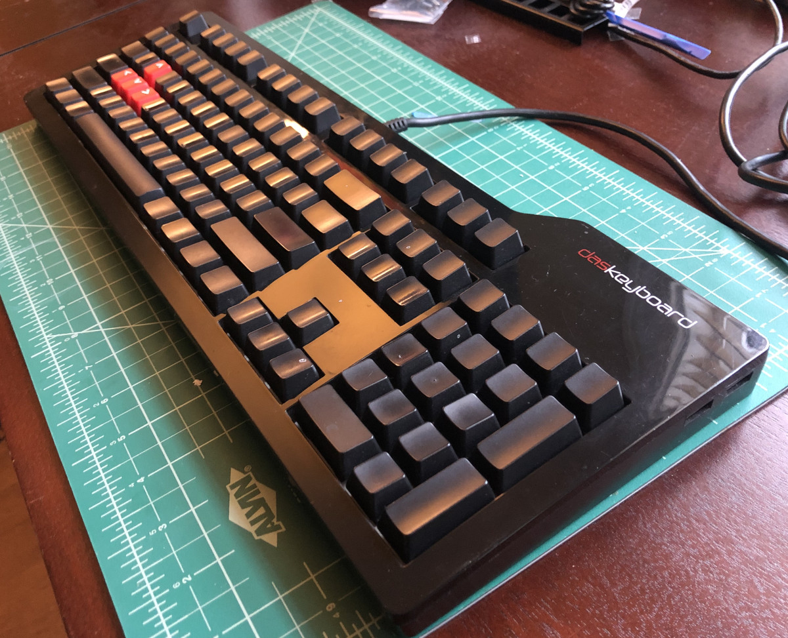
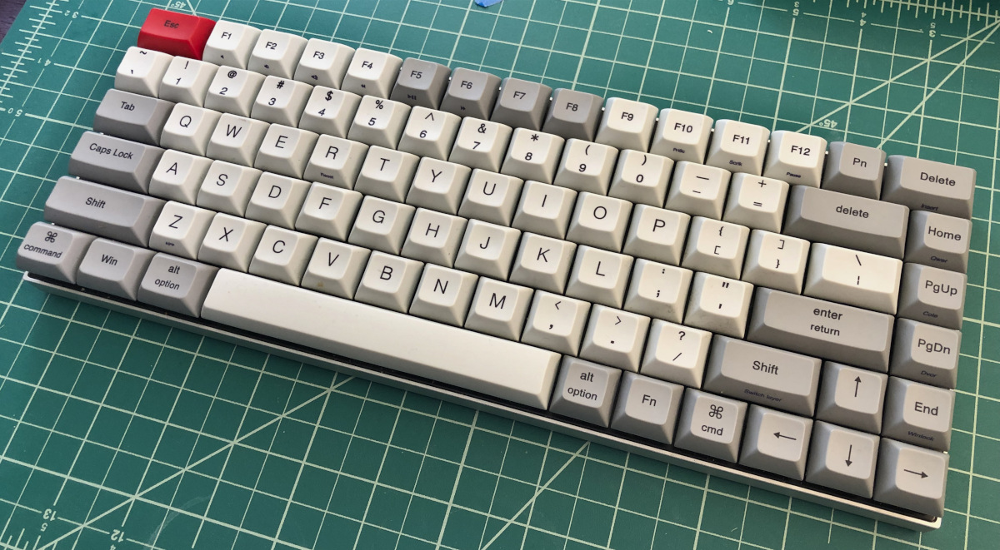
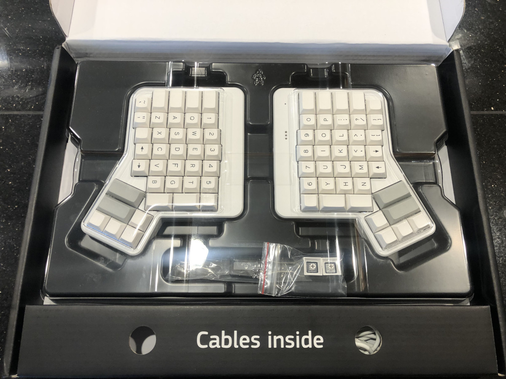
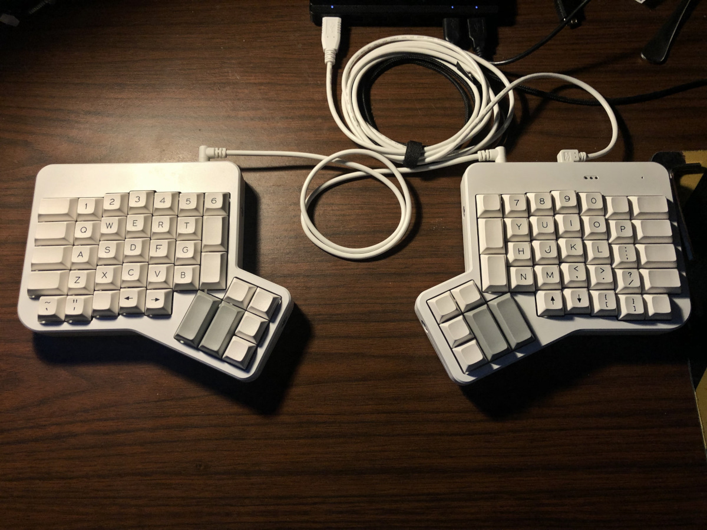
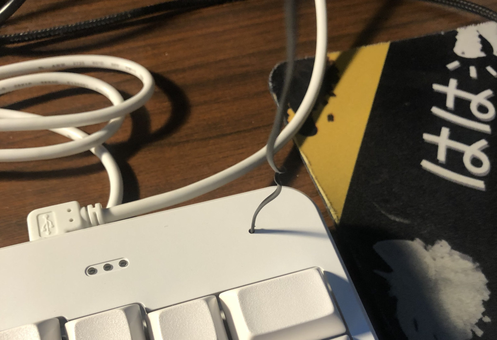

## Hey, it's been a minute! 

I've been tossing around post ideas in my head for the past couple weeks but nothing has materialized until today. I want to cover the issues I've been having with my WiFi adapter on Fedora, but haven't really done enough research to warrant a post. Maybe in a couple weeks! Anyways, enough rambling, onto the post.

---

It shouldn't come as a surprise that I'm into mechanical keyboards in a big way. It started back in elementary school, if you can believe that. Our school's library had some old Pentium-based computers, and six-year-old me noticed that they were different, in some way, from the computers I was used to. They weren't like the K6-based system we had at home, or the classroom computers that I had been using to learn typing - these computers had *loud* keyboards! Of course, being a young kid, I liked to make noise, but these were satisfying to use in a way I didn't really understand at that age. 

Fast-forward to the start of high school, and one of my friends picks up a little product called the Das Keyboard Model S. Using it was the first time in a long while that I had given keyboards a second thought! Sure, I knew about oddities like the Logitech G15, but generally I just thought of a keyboard as a commodity product. It was just something that you needed to operate the computer, and didn't warrant much thought beyond that.

  

This Das Keyboard, on the other hand... this was something worth getting excited about. A USB hub! Those clicky keys! That glossy finish! Wait, you mean it doesn't have any letters on it? How do you type? 

I ended up picking up one of my own (a tough ask, being a broke high-school kid), and it completely changed my perception of what a keyboard could be. They were no longer just *a thing* that you used. They were their own aspect of computing that warranted deep inspection, a decision as important as any other piece of hardware which made up your computer. My interest really took off after college, as I got my first "real" job in software. Living at home, I had plenty of extra spending money (funny how that works!), and the most logical thing to spend it on was something that I used for hours and hours every day. After a year or so of trying new things every few months, I settled on a compact 75% keyboard by Vortex, the Race 3.

  
This keyboard met all my needs for a long time. From trying other form factors, I had learned that I had a pretty low tolerance for special modifiers, especially when commonly used keys (delete, arrow keys, F-keys) were hidden behind them. It usually meant I had to make some fairly uncomfortable hand movements, which I didn't want to be doing on a regular basis. The Race 3 also came with nice POM keycaps, with spherical indentations. I generally find this style to be more comfortable to use, as the indentation tends to guide your finger to the center of the key no matter where it lands initially. As an added bonus, the board was relatively affordable at $139.

I loved this keyboard, and still do! It's a great compromise between size and functionality. However, in the past few years I've started developing what I can only assume is some form of RSI in my left wrist. It's not an all-the-time sort of pain - it would manifest almost like a sprain every few months. It'd clear up after a week or so, but I realized that this was something potentially being exacerbated by my choice of keyboard.

## Making the Jump

I was somewhat familar with the Ergodox, and ergo/ortholinear keyboards in general, before I started exploring how to fix this issue. They were one of those oddities that would pop up from time to time in the mech keyboard community; Something I always found interesting as a concept, but not something I had seen as compelling enough to drop the money on. Ortholinear keyboards always trended towards impractically small, layer-dense keyboards which I would never consider using on a daily basis, and so-called "ergo" keyboards such as the Ergodox were off-putting simply due to their straight-up alien appearance.

In light of my wrist troubles, however, I started taking another look at the Ergodox. I had been looking for a new keyboard for a while - it'd been going on a few years since my last keyboard purchase and the landscape had changed significantly. Hot-swappable switches, rotary encoders, USB-C... The list goes on. I could spend an entire separate article talking about keyboard trends, but the imporant takeaway is that my beloved Race 3 was feeling fairly old-hat as I found myself going into 2022. I was brainstorming ideas of how to take my keyboard setup forward, the Ergodox was where I landed.

## The Keyboard

 
I'm aware that the Ergodox is open-source hardware, and buying the EZ could be construed as "cheating". Unfortunately, the reality is that by virtue of being both incredibly niche and being open-source, Ergodox keyboards practically have no economies of scale. Now, this isn't a problem exclusive to the Ergodox - basically every non-standard keyboard has this problem. What it means is that building one from a kit, perhaps the "kosher" way to approach a peripheral like the Ergodox, was a bit too rich for my blood. What if I end up hating it? Am I just supposed to accept throwing $350+ down the drain, just so I can say I did it "correctly"? The folks over at ZSA make that a bit easier to stomach with the EZ. While they *are* built to order, their successful indiegogo campaign and (apparent) continued success means that they manage to get the price down to a more managable level.

Besides that, ZSA's Ergodox EZ is a compelling package. It comes fully populated with your choice of Cherry branded keyswitches (including their silent series, which I chose), wonderful Signature Plastics DSA keycaps, and a proper case. I skipped all the bells and whistles for my Ergodox - I'm not really one for RGB backlighting or underglow. At the time I ordered my example, they were running a $20 discount as they tried to clear out the remaining stock of USB-Mini based keyboards, in anticipation of their switch to a USB-C connector. I didn't really mind - USB-Mini is perfectly acceptable in my view. All said, including shipping, the price came out to $250. Hard to stomach for a layman, but borderline bargain-bin for anyone that's looked into building a custom keyboard before.

  
Installation and assembly was... well, there was none! I unpacked it and plugged it in. Buying prebuilt has benefits! I do have to admit, it's quite a strange feeling plugging an audio cable into your keyboard. Yep, that's an audio cable; It's not carrying audio though. It's how the keypresses from the left side make their way over to the right side, and into the USB interface.

  
You might notice that the key layout isn't *quite* the same as it was while it was still in the box. The stock Ergodox EZ layout is certainly... opinionated. The alphabet and numbers are pretty bog standard, but the stock thumb clusters are strange, and I just can't give up my asdf-row control key. ZSA, thankfully, are aware that not one size fits all and provide an [awesome, online configuration tool](https://configure.zsa.io/) which gives you a graphical interface to manipulate the keyboard layout. It'll even compile firmware packages for you, and they make flashing a breeze with their [wally](https://github.com/zsa/wally) tool.

I seriously can't sing enough praise for ZSA's software - the longer I use this keyboard, the more I realize that it lives and dies by its layouts. ZSA obviously know their product well, and their tooling represents that. Providing great, graphical tools for users to configure this kind of stuff is absolutely instrumental, and as far as I'm concerned ZSA sets the benchmark for this kind of stuff. **If every custom keyboard was like this, I'd be broke.**

The only weak spot I can pinpoint is the process of putting the keyboard into programming mode. I can understand *why* they didn't do it, but there's no easy way to access the switch which resets the keyboard. There's a tiny hole at the top of the right-half of the keyboard, and wally suggests that a paperclip is used to reset the keyboard. Well, I'm not exactly in a 'real' office anymore, and my home office doesn't deal with paper all that often... so I had to get creative.

> Yes, that's a bread tie. No, I'm not proud of it.

Speaking of ZSA knowing their product well, I'm wishing I would have taken their suggestion and not skipped the wrist rest and tilt/tent kit. I've only had the keyboard for a few days, and I can already tell that having those accessories would improve the experience significantly. The keyboard is *thick*, and not in a good way: It's just a little awkwardly tall, to the point where my arms and wrists are asking for a little extra support. That support situation would also be improved by having the keyboard meet my wrists where they rest naturally, by tenting the middle. At the very least tilting the back of the keyboard up would help with the thickness situation, so that my thumbs aren't resting approximately 35,000 feet in the air when resting them on the thumb clusters.

I picked up about 60% of my regular-keyboard speed in the few days that I've had this board, and my mistakes are getting fewer and farther between. It's still one hell of a learning curve, though. The orthlinearity throws me for a loop - I spent the last 25 years building muscle memory with staggered keyboards. I'm constantly hitting B instead of V. Hopefully that clears up with practice. More practice is half the purpose of this blog post, after all! ;)

I had to spend a lot of time tweaking the layout to my liking - thankfully this is another spot where ZSA's software shines. Their Oryx configuration tool, which I linked above, has the added bonus of containing a searchable database of layouts, tagged for their intended use. Naturally, I dug straight for the "coding" tag, and found something that seemed to have a lot of good ideas: [epitone 2.0](https://configure.zsa.io/ergodox-ez/layouts/W4Vo3/latest/0). This had a traditional number row, putting keys like the backtick, control, and meta keys into logical places. It wasn't perfect, though, so I made [some modifications](https://configure.zsa.io/ergodox-ez/layouts/BzO7D/latest/0) over the past few days. 

Oh, did I mention that you don't need an account to save layouts, it lets you download a .zip containing the source code, and lets you generate a PDF of your layout, including all the layers? Did I mention that ZSA **know how to make amazing products that are easy to use**? Have I mentioned that enough yet?

This is genuinely Apple-tier work. This is how easy-to-use I want **my** products to be. This is the level of "just works" that any engineer should aspire to. It doesn't get in the user's way, it doesn't try to cross-sell, it doesn't lock its workings behind smoke and mirrors. It's a collection of tools that do specific things incredibly well, creating an ecosystem where basically every eventuality is accounted for. It's the perfect amount of abstraction over the top of open-source software.

## Conclusions

### I love this keyboard.

Seriously. It's been a while since I've had a product exceed my expectations like this. I went in to this experience expecting to learn something new about typing, but I learned so much more. I might not even be using this keyboard six months from now, if I'm being honest. I'm having a tough time adjusting so far, but it might just take more practice. It's completely possible that I come to the conclusion that the physical design is a bit too opinionated for the way I type, and the work I usually do on my computer.

What *will* be here in six months, however, is the impact of seeing what good periperal software can look like. 

This is my new benchmark.

\- snepi
