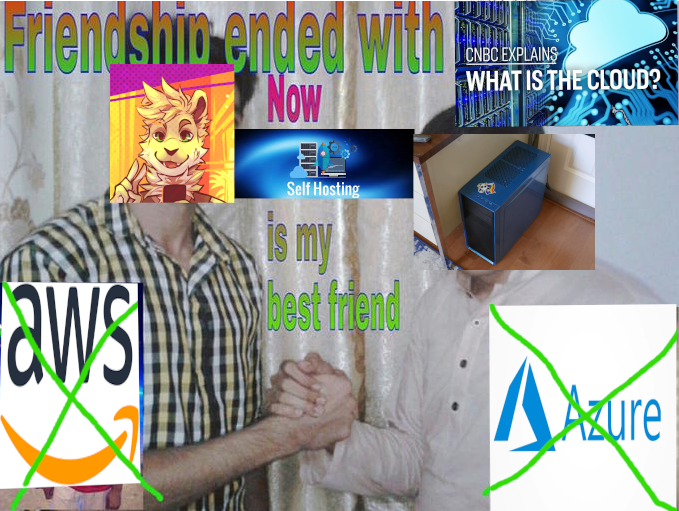

This past week, I used Tailscale and a Hetzner VPS to adopt a new hosting model for this blog and the fediverse instance I run at [cloth.social](https://cloth.social). I figured it was worth doing a little write-up that goes into what it is, why it's my new preferred hosting model, and why I think you should use it if you're looking for a thrifty way to put applications on the internet.

## Cloud Hosting

VPS providers have been the go-to option for hosting internet applications for a long time now. These services are great: Besides being easier than buying and setting up hardware, they simplify making VMs internet accessible. You just create a VM on DigitalOcean or Hetzner, connect to it, and deploy your code/assets. You're charged a monthly fee, but your app is available to the world in a consistent, logical place.

While this does work, I argue that this naieve method is not economically sound for the discerning DIYer[^1], and it actually makes you less likely to do things on the internet. To explain this argument, it helps to lay out what cloud hosting actually is and why it works.

## Super Cereal Business Talk

This is, ultimately, an argument of cost and utility. When you spin up a VM on a cloud provider, you're paying for:

- A public IPv4 address and internet connection
- Storage space, CPU time, and Memory usage
- SRE salaries, to metaphorically keep the lights on
- Salaries of facility workers, to literally keep the lights on
- The salary of the security guard at the front desk
- The cost of the building, both CapEx and recurring costs like air conditioning & power
- Redundant Everything
- SWEs to maintain all the web apps and APIs you use to interact with your VM(s)

And the list goes on.

VPS providers' business models are based around charging *businesses* for computing resources. Businesses need all of the above, so they don't mind paying it. Let's run through these benefits from the perspective of the home user.

Many VPS providers tout the ease with which VMs can be created, but really all this does is let them start billing you. Of course it's easy! In reality, this is of very little use unless you're spinning up a dozen VMs in a month.

Uptime guarantees aren't necessary for the average self-hoster. Unless you're hosting things that make you money, they will never be worth the extra cost. Everything after the second bullet point in that list exists to pump up the availability numbers of the provider's infrastructure. These comprise the *vast majority* of the costs associated with cloud hosting.

The only utility unique to cloud providers, in my view, are the public IPv4/IPv6 addresses that each VM is assigned. Most admins with any degree of skill can provide everything else cheaper on their own, except for those damn addresses.

Why pay for all of the other stuff?

## Self-Hosting

Okay, we hate the Cloud. Friendship ended, but we still want to put some content on the internet. What do we do?

The plain and simple solution is expose port 443 to the internet from a computer at home, and sprinkle in your choice of VMs or Docker containers to flavor. If you're Very Computer like I am, you probably have a candidate for this gathering dust somewhere as you read this.

Unfortunately, this isn't always as easy as it sounds.

The networking troubles I've encountered with self-hosting web-facing apps largely manifest in everyone's favorite punching bag, DNS. First, things behave....Strangely when your local network has a difference of opinion with the rest of the internet on what a name resolves to. There's lots of software (and hardware!) out there which believes:

> "The WAN is the WAN, and the LAN is the LAN, and never the twain shall meet."

It's hard to give concrete examples of this, especially since the last time I tried it was so long ago. Suffice it to say that I had some *very* strange connectivity problems with web-facing applications hosted on my LAN.[^2] It's not such a big deal for websites, but more interactive applications naturally have more trouble.

Hosting things at your place of residence also has privacy implications. The sad reality is that there's enough unhinged people on the internet that it's worthwhile to directly protect the public IPv4 address that your ISP assigns you. This is the line that all those YouTube VPN providers use to sell their ~~grifts~~ services. It works because like all good lies, it's not entirely false.

Finally, the nature of public IPv4 addresses (we don't have enough) also means that the public IP address of your LAN is subject to change at any time.[^3] This, combined with the nature of DNS (records are cached, and sometimes TTL is ignored), means that an IP address change can be _devastating_ for connectivity in the short term. You also have to make these updates manually,[^4] so you may not even notice you're offline until you leave the house or your deployed application starts breaking in some unintuitive way.

## My Hybrid Setup

Clearly, a better solution would lie somewhere in the middle. I think I've found it.

My setup uses a [Caddy](https://caddyserver.com) reverse proxy running on a Hetzner VM. On a spare computer at home, there are a couple virtual machines running the applications I want to expose to the internet. The reverse proxy VM and the virtual machines are connected to a VPN using [Tailscale](https://tailscale.com/).

Using Tailscale solves a very important problem: the connection between the reverse proxy VM and the computers on my home network is now totally agnostic of the public IP address of my home LAN. This solves the networking problem, while the Hetzner VM solves the privacy problem. As a bonus, I also don't have to play around with firewall configuration on my home network!

Tailscale also has a pretty kick-ass feature in "MagicDNS" - when enabled, each device on the VPN is assigned its own unique DNS name. This means that even if a device connected to the VPN changes its IP address (IPs on the VPN are dynamically assigned), all members of the VPN still know where it is. I'm using this to strengthen my reverse proxy configuration - Caddy is dispatching traffic to the VMs by name, not by IP address.

There's not really much else to say! It is, by all metrics, a completely unremarkable use of Tailscale and HTTP reverse proxy software. That's what I love about it. It's unremarkable and simple, and there's very little to go wrong. The complexity lies within the applications themselves, where it belongs.

## Some Notes

I chose Hetzner because they offered, by far, the most amount of bandwidth per month for the price. My $7-ish/mo VM gets a whopping 20TB of transfer per month. It's important to keep in mind that this setup effectively doubles the bandwidth consumption of your application, from the cloud provider's perspective. I'll use nowhere near 20TB of transfer per month, but it's nice to have it.

This setup made my applications available to the IPv6 internet, despite the fact that my ISP is not a part of the IPv6 internet. Everything on Tailscale has an IPv6 address, and my Hetzner VM has a public IPv6 address. Ergo my website is now IPv6. I guess it's a bit like a reverse tunnel-broker, in a way? It was a pleasant surprise.

This works really well for HTTP-based web applications, but that's only by virtue of reverse-proxying being a very common use pattern for HTTP traffic. I wouldn't expect to run a game server in this fashion. You could probably make it work with some firewall rules, but I would be surprised if it worked *well*. Things like Git over SSH wouldn't be straight-forward either. This isn't a cure-all, but it's an approach I'm interested to explore more of.

---

[^1]: Everyone's economic situation is different. Maybe some folks wouldn't even blink at spending hundreds of dollars per month on compute costs. Good for you, if that's the case!
[^2]: This kind of 'relative location' DNS setup would work better if your LAN has a more "enterprise" DNS setup. Mine did not and does not. It still is weird to have globally-resolvable domains resolve to RFC1918 addresses, IMO.
[^3]: Some residential ISPs will let you pay for a static IP address, at an additional cost. This varies by ISP, and still doesn't solve the privacy concerns.
[^4]: There exists (albeit mostly in the past) an idea of "Dynamic DNS", wherein a device on your LAN will inform your DNS provider of updates to your public IPv4 address and automatically update the corresponding DNS records. This never really saw broad adoption for a myriad of reasons, and is (IMO) not an option worth considering in 2023. I'm sure there's someone out there still using it, though.
